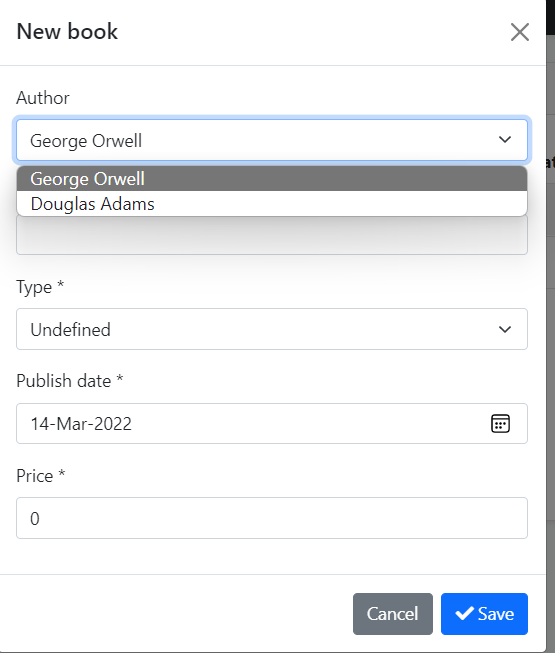
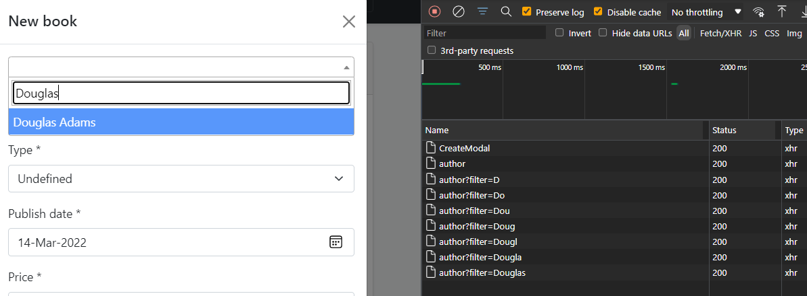

# Using Auto-Complete Select

In this article, I'll demonstrate a select implementation that works with pagination and server-side search for huge amount datas.

## Source Code

Source code also available on [abp-samples/AutoCompleteSelect](https://github.com/abpframework/abp-samples/tree/master/AutoCompleteSelect)

## Getting Started
I prefer to use final state of [Web Application Development](https://docs.abp.io/en/abp/latest/Tutorials/Part-10) tutorial as a base. You can check out the source code section of article from [here to download](https://docs.abp.io/en/abp/latest/Tutorials/Part-10?UI=MVC&DB=EF#download-the-source-code) last state.

1. Run DbMigrator if you're running this project first.
2. Then run the **Web** layer.

When you run this project, you'll see a regular select while adding new book.




## Part I: Single select

- Go to `Pages/Books/CreateModal.cshtml.cs` and remove `Authors` property and its usages.

- Remove `[SelectItems(nameof(Authors))]` attribute and add `[DynamicFormIgnore]` on `AuthorId` in `CreateBookViewModel` class.

    ```csharp
    [DynamicFormIgnore]
    [DisplayName("Author")]
    public Guid AuthorId { get; set; }
    ```

- Add an id to modal body for keeping select2 inside the modal. Otherwise it might be placed behind the modal. And send that id as `data-autocomplete-parent-selector` parameter.

    ```csharp
    <abp-modal-body id="createBookModalBody">
        <select asp-for="Book.AuthorId" 
            class="auto-complete-select"
            data-autocomplete-api-url="/api/app/author"
            data-autocomplete-display-property="name"
            data-autocomplete-value-property="id"
            data-autocomplete-items-property="items"
            data-autocomplete-filter-param-name="filter"
            data-autocomplete-parent-selector="#createBookModalBody">
        </select>
        <abp-form-content />
    </abp-modal-body>
    ```
- Open the Create modal and see it's working with server-side search.

    

- Do the same for **EditModal** too. Remove `Authors` property and its usages from `EditModal.cshtml.cs` and remove `[SelectItems(nameof(Authors))]` attribute then add `[DynamicFormIgnore]` attribute on `AuthorId` property of `EditBookViewModel`.

    ```csharp
    [DynamicFormIgnore]
    [DisplayName("Author")]
    public Guid AuthorId { get; set; }
    ```

- Update operation is a bit different, select should be initialized with selected.

---

## Part II: Multiple select