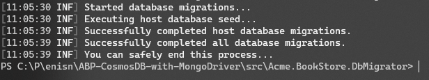

# How to use Cosmos DB in ABP?

There is a couple of ways to use Cosmos DB in C#. Cosmos DB has an SQL API and MongoDB API at the same time. Also there is a [Entity Framework Provider of Cosmos DB](https://docs.microsoft.com/en-us/ef/core/providers/cosmos/) which is based on SQL API but I recommend to use MongoDB Driver since Cosmos is a document based database. So, in this article, accessing to Cosmos DB will be with the MongoDB Driver.


### Setting up Development Environment

There a Cosmos DB Emulator for development purposes. It's easy to setup for development.


You can follow those instructions to set up Cosmos DB for MongoDB Driver:

- [Install and develop locally with Azure Cosmos DB Emulator | Microsoft Docs]([Install and develop locally with Azure Cosmos DB Emulator | Microsoft Docs](https://docs.microsoft.com/en-us/azure/cosmos-db/local-emulator?tabs=ssl-netstd21#download-the-emulator))

> **Notice:** Do not forget to start emulator with `/EnableMongoDbEndpoint` parameter from CLI. The example is presented [here](https://docs.microsoft.com/en-us/azure/cosmos-db/local-emulator?tabs=ssl-netstd21#azure-cosmos-dbs-api-for-mongodb).


## Start Development


### 1- Creating ABP Application

In this example, we'll use MongoDB Driver to connect Cosmos DB as I said before, so let's create project with `-d mongodb`

```bash
 abp new Acme.BookStore -d mongodb -v 5.0.0-rc.1
```


### 2- Configuring the Project

Determine your connection string. If you're using default configuration of Cosmos DB Emulator, your connection string should be like below:

```
mongodb://localhost:C2y6yDjf5%2FR%2Bob0N8A7Cgv30VRDJIWEHLM%2B4QDU5DE2nQ9nDuVTqobD4b8mGGyPMbIZnqyMsEcaGQy67XIw%2FJw%3D%3D@localhost:10255/AcmeBookStore?ssl=true
```

> Format is presented as [Connection String URI Format](https://docs.mongodb.com/manual/reference/connection-string/). So you can make changes based on this format according to your requirements.


- Replace connection string in `src/Acme.BookStore.DbMigrator/appsettings.json` and `src/Acme.BookStore.Web/appsettings.json`:

```diff
{
  "ConnectionStrings": {
-  "Default": "mongodb://localhost:27017/BookStore"
+  "Default": "mongodb://localhost:C2y6yDjf5%2FR%2Bob0N8A7Cgv30VRDJIWEHLM%2B4QDU5DE2nQ9nDuVTqobD4b8mGGyPMbIZnqyMsEcaGQy67XIw%2FJw%3D%3D@localhost:10255/AcmeBookStore?ssl=true"
  }
}
```


### 3- Configure & Run Migrations

Some more changes are required before running migrations. Creating a scheme isn't required anymore.

- Go `BookStoreDbMigrationService.cs` file under **Acme.BookStore.Domain/Data** folder nd remove `MigrateDatabaseSchemaAsync`:

```diff
public async Task MigrateAsync()
{
    Logger.LogInformation("Started database migrations...");
-    await MigrateDatabaseSchemaAsync();
    await SeedDataAsync();
    Logger.LogInformation($"Successfully completed host database migrations.");
    var tenants = await _tenantRepository.GetListAsync(includeDetails: true);
-    var migratedDatabaseSchemas = new HashSet<string>();
    foreach (var tenant in tenants)
    {
        using (_currentTenant.Change(tenant.Id))
        {
            if (tenant.ConnectionStrings.Any())
            {
                var tenantConnectionStrings = tenant.ConnectionStrings
                    .Select(x => x.Value)
                    .ToList();
-                if (!migratedDatabaseSchemas.IsSupersetOf(tenantConnectionStrings))
-                {
-                    await MigrateDatabaseSchemaAsync(tenant);
-
-                    migratedDatabaseSchemas.AddIfNotContains(tenantConnectionStrings);
-                }
            }
            await SeedDataAsync(tenant);
        }
        Logger.LogInformation($"Successfully completed {tenant.Name} tenant database migrations.");
    }
    Logger.LogInformation("Successfully completed all database migrations.");
    Logger.LogInformation("You can safely end this process...");
}
```


- Also you should remove entire method

```diff
-private async Task MigrateDatabaseSchemaAsync(Tenant tenant = null)
-{
-    Logger.LogInformation(
-    $"Migrating schema for {(tenant == null ? "host" : tenant.Name + " tenant")} database...");
-
-    foreach (var migrator in _dbSchemaMigrators)
-    {
-    await migrator.MigrateAsync();
-    }
-}
```

- DbMigrator is ready to execute now. Run `Acme.BookStore.DbMigrator` project and complete data seeding.

After you see screen below, your application is completely ready.



### 4- Run the Project

Run the `Acme.BookStore.Web` project and see the result. All existing modules are working smooth with Cosmos DB.