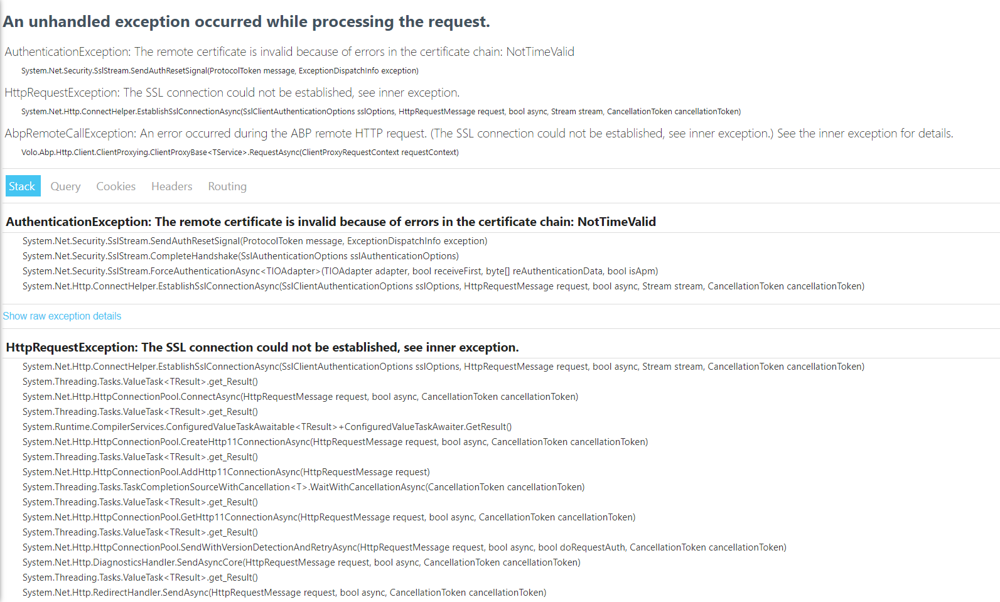

# Using MassTransit via eShopOnAbp

MassTransit is a open-source distributed application framework for .Net. MassTransit makes it easy to create applications and services. It creates the structure on the different tools. 
- In Memory
- RabbitMQ - We will select the rabbitmq and continue via that.
- Azure Service Bus
- SQS


This project is a reference for who want to build microservice solutions with the ABP Framework.

See [the announcement](https://blog.abp.io/abp/Introducing-the-eShopOnAbp-Project) post for more info.

## Issues

Please open issues on the main GitHub repository: https://github.com/abpframework/abp/issues

## How to Run?

You can either run in Visual Studio, or using [Microsoft Tye](https://github.com/dotnet/tye). Tye is a developer tool that makes developing, testing, and deploying micro-services and distributed applications easier.

 ### Requirements

- .NET 6.0+
- Docker
- Yarn

### Instructions

- Clone the repository ( [eShopOnAbp](https://github.com/abpframework/eShopOnAbp) )

- Install Tye (*follow [these steps](https://github.com/dotnet/tye/blob/main/docs/getting_started.md#installing-tye)*)

- Rename `.env.example` file to `.env` file and provide PayPal ClientID and Secret.

- Execute `run-tye.ps1`

- Wait until all applications are up!

	- You can check running application from tye dashboard ([localhost:8000](http://127.0.0.1:8000/))
	- **Note**: If you see all of your applications keep restarting on tye dashboard or tye console, you may be facing ssl certificate issues. To diagnose the problems better, check any application logs. If it is related with SSL, developer certificate creation may have failed because of powershell issues regarding authorization. Check the powershell script running configuration and set policy for your local machine as: 
	```bash
	Get-ExecutionPolicy list
	Set-ExecutionPolicy -ExecutionPolicy RemoteSigned -Scope LocalMachine
	```
	See [Microsoft Powershell documentation](https://docs.microsoft.com/en-us/powershell/module/microsoft.powershell.security/get-executionpolicy?view=powershell-7.2) for more information.

- After all your backend services are up, start the angular application:

  ```bash
  cd apps/angular
  yarn start
  ```

### Certificate Expiration
If the cerficiate is expired you'll see following error:

<!-- Make it smaller with 320px height  -->


Generating a new certificate will fix that issue. To generate new one,

- Remove `etc/dev-cert/localhost.pfx`

- Manually execute `create-certificate.ps1` **or** re-run solution with `run-tye.ps1`


## Roadmap
### Version 1.0

- [x] New blank micro-service solution ✔️
- [x] Creating Deployment Scenarios ✔️
- [x] Creating empty business services ✔️
- [x] Implementing	 business logic into services ✔️
  - [x] Payment with PayPal ✔️
  - [x] Basket, Catalog, Order Service ✔️
- [x] Docker Image creation ✔️
- [x] Helm deployment for local k8s cluster ✔️
- [x] Switch Ocelot to <strike>Envoy</strike> YARP in Public Web gateway ✔️
- [x] Use gRPC for catalog microservice ✔️
- [x] Management Side of Services ✔️
- [x] Administration application (to manage products and orders, with a dashboard) ✔️
- [x] Product-detail page on the shopping application (with CMS-kit integration for comments and rating components) ✔️
- [x] Deployment to azure k8s ✔️ (https://eshoponabp.com)
### Version 2.0
- [ ] Switch to Keycloak from IdentityServer in AuthServer
- [ ] Re-design authorization/permission management
- [ ] Integrate a new sample microservice written in GoLang (Or python/java)
### Documentation

- [ ] We will create an e-book to explain the solution

## Current Architecture


## ABP Community Talks

We've organized a meetup related to this solution. You can watch it here: https://community.abp.io/posts/abp-community-talks-2022.1-microservice-development-a98jnsa0
