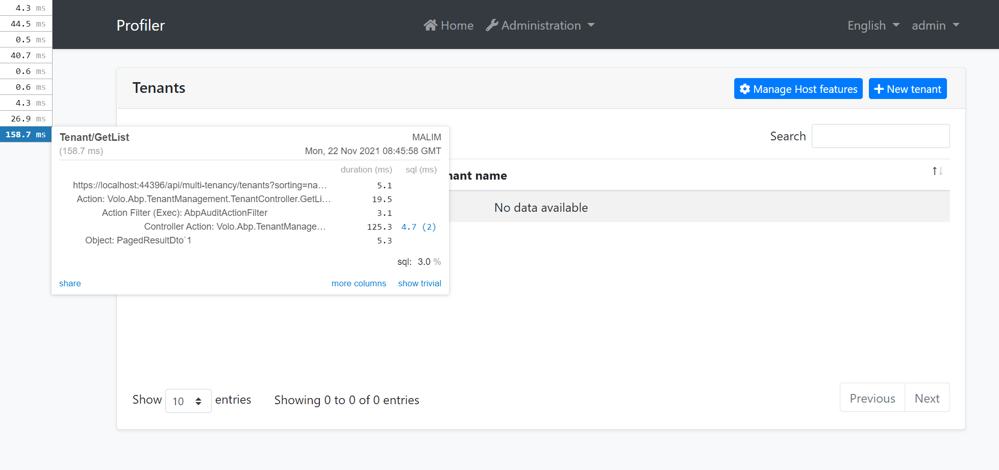
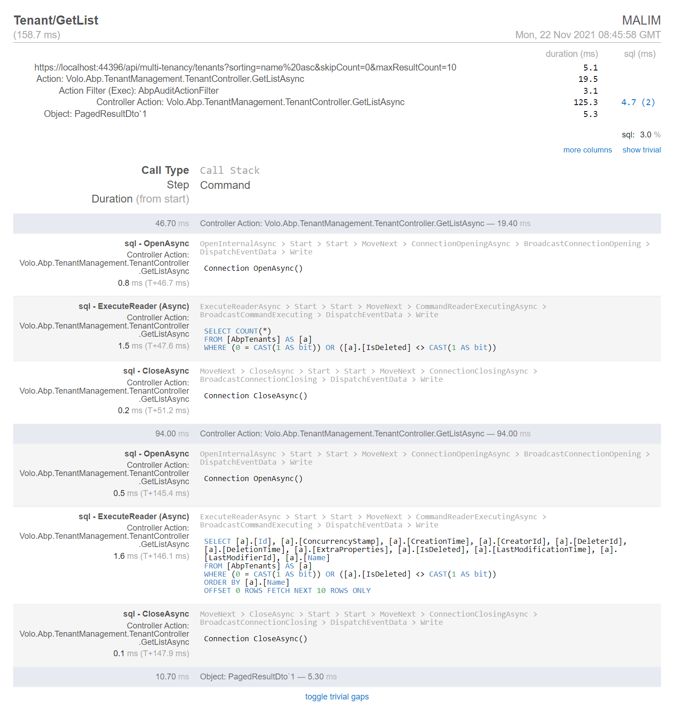

# Using MiniProfiler with the ABP Framework

`MiniProfiler` is a library and UI for profiling your application. By letting you see where your time is spent, which queries are run, and any other custom timings you want to add, MiniProfiler helps you debug issues and optimize performance.

## The Source Code

You can get the source code in this article at https://github.com/abpframework/abp-samples/tree/master/MiniProfiler

## Getting Started

### 1- Creating ABP Application

```bash
 abp new Profiler -t app
```

### 2- Add MiniProfiler packages to the Profiler.Web project.

```
<PackageReference Include="MiniProfiler.AspNetCore.Mvc" Version="4.2.22" />
<PackageReference Include="MiniProfiler.EntityFrameworkCore" Version="4.2.22" />
```

### 3- Configure MiniProfiler

1. Configure `MiniProfiler` in `ConfigureServices` method of `ProfilerWebModule`.

```cs
public override void ConfigureServices(ServiceConfigurationContext context)
{
    var hostingEnvironment = context.Services.GetHostingEnvironment();
    var configuration = context.Services.GetConfiguration();

    ConfigureMiniProfiler(context);
}

private void ConfigureMiniProfiler(ServiceConfigurationContext context)
{
    context.Services.AddMiniProfiler(options =>
    {
        //More options see https://miniprofiler.com/dotnet/AspDotNetCore
    }).AddEntityFramework();;
}
```

2. Add `MiniProfilerViewComponent(Profiler.Web\Components\MiniProfiler\MiniProfilerViewComponent.cs)`

```cs
public class MiniProfilerViewComponent : AbpViewComponent
{
    public virtual IViewComponentResult Invoke()
    {
        return View("~/Components/MiniProfiler/Default.cshtml");
    }
}
```

`Default.cshtml(Profiler.Web\Components\MiniProfiler\Default.cshtml)`
```cs
<mini-profiler />
```

`_ViewImports.cshtml(Profiler.Web\Components\_ViewImports.cshtml)`
```cs
@addTagHelper *, Microsoft.AspNetCore.Mvc.TagHelpers
@addTagHelper *, Volo.Abp.AspNetCore.Mvc.UI
@addTagHelper *, Volo.Abp.AspNetCore.Mvc.UI.Bootstrap
@addTagHelper *, Volo.Abp.AspNetCore.Mvc.UI.Bundling
@using StackExchange.Profiling
@addTagHelper *, MiniProfiler.AspNetCore.Mvc
```

3. Add `MiniProfilerViewComponent` to Layout.

```cs
context.Services.Configure<AbpLayoutHookOptions>(options =>
{
    options.Add(LayoutHooks.Body.Last, typeof(MiniProfilerViewComponent));
});
```

4. Add `UseMiniProfiler` to the ASP.NET Core pipeline.

```cs
public override void OnApplicationInitialization(ApplicationInitializationContext context)
{
    var app = context.GetApplicationBuilder();
    var env = context.GetEnvironment();

    //...Other middlerware

    //Here
    app.UseMiniProfiler();

    app.UseStaticFiles();
    app.UseRouting();
    app.UseAuthentication();
    app.UseAuthorization();
    app.UseConfiguredEndpoints();
}
```

### 4- Migrate and run the Project

Run the `Profiler.DbMigrator` and then run the `Profiler.Web` project and see the result.



