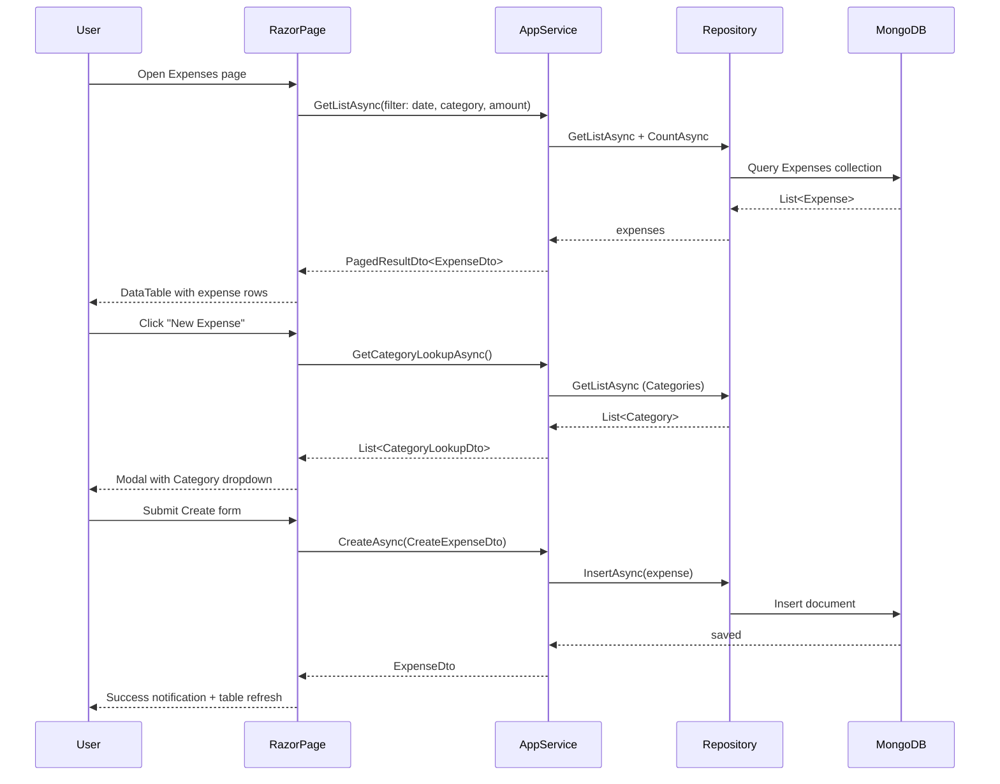

# Personal Budget App — Categories & Expenses Feature

## 2. Solution

Build a full CRUD feature for **Categories** and **Expenses** within the existing single-layer ABP + MongoDB project. Categories act as a classification grouping for expenses (one-to-many). Both features follow the same established project conventions already visible in `PersonalBudget/Services/PersonalBudgetAppService.cs`, `PersonalBudget/Data/PersonalBudgetDbContext.cs`, and `PersonalBudget/Permissions/PersonalBudgetPermissions.cs`.

### Key Design Decisions

- **`Category` is an independent aggregate root** — it does not embed expenses inside it. Expenses reference categories by `CategoryId` (reference by ID, not navigation property). This is the correct DDD + MongoDB pattern.
- **`Expense` is a separate aggregate root** — queried independently and filtered by category, date, and amount.
- **No custom domain service needed** — business rules are simple enough to live inside entity constructors and setters. No cross-aggregate logic required at this stage.
- **Generic repositories only** — `IRepository<Category, Guid>` and `IRepository<Expense, Guid>` are sufficient. No custom repository interfaces needed.
- **Mapperly for mapping** — follows the existing `PersonalBudgetWebMappers.cs` Mapperly pattern already in the project.
- **Auto API Controllers** — already configured in the module (`ConfigureAutoApiControllers`), so no manual controller code is needed.
- **Authenticated users only** — all CRUD operations require login. Permission-based guards use the existing `PersonalBudgetPermissions` provider.

---

## 3. Workflow Diagram

---

## 4. Files Affected

### Domain — Entities
- `PersonalBudget/Entities/Category.cs` — new aggregate root entity
- `PersonalBudget/Entities/Expense.cs` — new aggregate root entity

### Data — MongoDB Context
- `PersonalBudget/Data/PersonalBudgetDbContext.cs` — add `IMongoCollection<Category>` and `IMongoCollection<Expense>` + configure collection names

### Services — DTOs
- `PersonalBudget/Services/Categories/CategoryDto.cs` — output DTO
- `PersonalBudget/Services/Categories/CreateUpdateCategoryDto.cs` — create & update input DTO
- `PersonalBudget/Services/Categories/GetCategoryListInput.cs` — list filter input
- `PersonalBudget/Services/Expenses/ExpenseDto.cs` — output DTO (includes `CategoryName`)
- `PersonalBudget/Services/Expenses/CreateUpdateExpenseDto.cs` — create & update input DTO
- `PersonalBudget/Services/Expenses/GetExpenseListInput.cs` — list filter input
- `PersonalBudget/Services/Expenses/CategoryLookupDto.cs` — lightweight DTO for category dropdown

### Services — Application Services
- `PersonalBudget/Services/Categories/ICategoryAppService.cs` — service interface
- `PersonalBudget/Services/Categories/CategoryAppService.cs` — service implementation
- `PersonalBudget/Services/Expenses/IExpenseAppService.cs` — service interface
- `PersonalBudget/Services/Expenses/ExpenseAppService.cs` — service implementation

### Object Mapping
- `PersonalBudget/ObjectMapping/PersonalBudgetWebMappers.cs` — add Mapperly mappings for Category ↔ DTOs and Expense ↔ DTOs

### Permissions
- `PersonalBudget/Permissions/PersonalBudgetPermissions.cs` — add `Categories` and `Expenses` permission constants
- `PersonalBudget/Permissions/PersonalBudgetPermissionDefinitionProvider.cs` — register both permission groups

### UI — Pages
- `PersonalBudget/Pages/Categories/Index.cshtml` + `.cshtml.cs` — categories list page
- `PersonalBudget/Pages/Categories/CreateModal.cshtml` + `.cshtml.cs` — create modal
- `PersonalBudget/Pages/Categories/EditModal.cshtml` + `.cshtml.cs` — edit modal
- `PersonalBudget/Pages/Categories/Index.js` — DataTables + modal wiring
- `PersonalBudget/Pages/Expenses/Index.cshtml` + `.cshtml.cs` — expenses list page with filters
- `PersonalBudget/Pages/Expenses/CreateModal.cshtml` + `.cshtml.cs` — create modal (with category dropdown)
- `PersonalBudget/Pages/Expenses/EditModal.cshtml` + `.cshtml.cs` — edit modal
- `PersonalBudget/Pages/Expenses/Index.js` — DataTables + modal wiring + filter handling

### Navigation
- `PersonalBudget/Menus/PersonalBudgetMenuContributor.cs` — add "Categories" and "Expenses" menu items
- `PersonalBudget/Menus/PersonalBudgetMenus.cs` — add menu name constants

### Localization
- `PersonalBudget/Localization/PersonalBudget/en.json` — add all new localization keys

---

## 5. Implementation Steps

### Domain Layer

- [ ] **Create `Category` entity** as `AuditedAggregateRoot<Guid>` with:
  - `Name` (required, max 100 chars) — private setter, validated in constructor
  - `Description` (optional, max 500 chars)
  - `Icon` (optional, max 50 chars — e.g. `"fa-cart-shopping"`)
  - Protected parameterless constructor for MongoDB ORM
  - `SetName()` method enforcing `Check.NotNullOrWhiteSpace`

- [ ] **Create `Expense` entity** as `AuditedAggregateRoot<Guid>` with:
  - `CategoryId` (`Guid`) — reference by ID, not navigation property
  - `Description` (required, max 500 chars)
  - `Amount` (`decimal`, must be > 0) — private setter with validation
  - `Date` (`DateTime`) — use `IClock` at creation, private setter
  - `Notes` (optional, max 1000 chars)
  - Protected parameterless constructor for MongoDB
  - `SetAmount()` method that throws `BusinessException` if ≤ 0

### Data Layer

- [ ] **Register collections in `PersonalBudgetDbContext`** — add `IMongoCollection<Category> Categories` and `IMongoCollection<Expense> Expenses`, configure collection names (`"Categories"` and `"Expenses"`) in `CreateModel()`

### Application Layer — Categories

- [ ] **Define `ICategoryAppService`** extending `IApplicationService` with:
  - `GetAsync(Guid id)` → `CategoryDto`
  - `GetListAsync(GetCategoryListInput input)` → `PagedResultDto<CategoryDto>`
  - `CreateAsync(CreateUpdateCategoryDto input)` → `CategoryDto`
  - `UpdateAsync(Guid id, CreateUpdateCategoryDto input)` → `CategoryDto`
  - `DeleteAsync(Guid id)`

- [ ] **Implement `CategoryAppService`** inheriting `PersonalBudgetAppService`:
  - Inject `IRepository<Category, Guid>`
  - `GetListAsync` supports filtering by `Filter` (search string on Name) and paging/sorting via `PagedAndSortedResultRequestDto`
  - Apply `[Authorize(PersonalBudgetPermissions.Categories.Default)]` at class level; `Create`, `Edit`, `Delete` at method level
  - Use Mapperly mapper for entity ↔ DTO conversions

- [ ] **Create Category DTOs**:
  - `CategoryDto` — `Id`, `Name`, `Description`, `Icon`, audit fields (`CreationTime`)
  - `CreateUpdateCategoryDto` — `Name` (`[Required][StringLength(100)]`), `Description` (`[StringLength(500)]`), `Icon` (`[StringLength(50)]`)
  - `GetCategoryListInput` — extends `PagedAndSortedResultRequestDto`, adds `string? Filter`

### Application Layer — Expenses

- [ ] **Define `IExpenseAppService`** extending `IApplicationService` with:
  - `GetAsync(Guid id)` → `ExpenseDto`
  - `GetListAsync(GetExpenseListInput input)` → `PagedResultDto<ExpenseDto>`
  - `CreateAsync(CreateUpdateExpenseDto input)` → `ExpenseDto`
  - `UpdateAsync(Guid id, CreateUpdateExpenseDto input)` → `ExpenseDto`
  - `DeleteAsync(Guid id)`
  - `GetCategoryLookupAsync()` → `List<CategoryLookupDto>` (for dropdown, no permission required)

- [ ] **Implement `ExpenseAppService`** inheriting `PersonalBudgetAppService`:
  - Inject `IRepository<Expense, Guid>` and `IRepository<Category, Guid>`
  - `GetListAsync` supports filtering by: `Filter` (search on Description), `CategoryId?`, `MinAmount?`, `MaxAmount?`, `StartDate?`, `EndDate?` + paging/sorting
  - `GetAsync` resolves and includes `CategoryName` in the returned DTO by fetching category
  - `GetListAsync` resolves category names by fetching all relevant categories and joining in memory (avoids N+1 per MongoDB patterns)
  - Apply authorization at method level

- [ ] **Create Expense DTOs**:
  - `ExpenseDto` — `Id`, `CategoryId`, `CategoryName`, `Description`, `Amount`, `Date`, `Notes`, audit fields
  - `CreateUpdateExpenseDto` — `CategoryId` (`[Required]`), `Description` (`[Required][StringLength(500)]`), `Amount` (`[Range(0.01, double.MaxValue)]`), `Date` (`[Required]`), `Notes` (`[StringLength(1000)]`)
  - `GetExpenseListInput` — extends `PagedAndSortedResultRequestDto`, adds `Filter?`, `CategoryId?`, `MinAmount?`, `MaxAmount?`, `StartDate?`, `EndDate?`
  - `CategoryLookupDto` — `Id`, `Name` (used for dropdowns)

### Permissions

- [ ] **Add permission constants** in `PersonalBudgetPermissions.cs`:
  - `Categories.Default`, `Categories.Create`, `Categories.Edit`, `Categories.Delete`
  - `Expenses.Default`, `Expenses.Create`, `Expenses.Edit`, `Expenses.Delete`

- [ ] **Register permissions** in `PersonalBudgetPermissionDefinitionProvider` with localized display names for each permission

### Object Mapping

- [ ] **Add Mapperly mappings** in `PersonalBudgetWebMappers.cs`:
  - `Category` → `CategoryDto`
  - `CreateUpdateCategoryDto` → `Category` (for update, map into existing entity)
  - `Expense` → `ExpenseDto`
  - `CreateUpdateExpenseDto` → `Expense`
  - `Category` → `CategoryLookupDto`

### UI — Categories Page

- [ ] **Create `Pages/Categories/Index.cshtml`** using `abp-card`, `abp-table` tag helpers, "New Category" button (hidden if no Create permission)
- [ ] **Create `Pages/Categories/Index.cshtml.cs`** inheriting `AbpPageModel`; `OnGetAsync` is empty (data loaded via AJAX DataTable)
- [ ] **Create `CreateModal` and `EditModal`** using `abp-dynamic-form` with `abp-modal` structure; bind to `CreateUpdateCategoryDto`
- [ ] **Create `Index.js`** wiring ABP DataTables (server-side via `categoryService.getList`), create/edit modal management, delete with `abp.message.confirm`

### UI — Expenses Page

- [ ] **Create `Pages/Expenses/Index.cshtml`** with filter bar (category dropdown, date range pickers, amount range, text search) + DataTable showing Amount, Date, Category, Description
- [ ] **Create `Pages/Expenses/Index.cshtml.cs`** inheriting `AbpPageModel`; populate `Categories` list for filter dropdown via `GetCategoryLookupAsync()`
- [ ] **Create `CreateModal` and `EditModal`** with category `<select>` dropdown populated from `GetCategoryLookupAsync()`, date picker input, amount field
- [ ] **Create `Index.js`** wiring server-side DataTable with filter parameter passing, modal management, formatted amount column (currency), delete confirmation

### Navigation & Localization

- [ ] **Add menu items** in `PersonalBudgetMenuContributor`: "Categories" and "Expenses" as top-level items (or under a "Budget" group), gated by `.Default` permissions
- [ ] **Add menu constants** in `PersonalBudgetMenus.cs`
- [ ] **Add localization keys** to `en.json`: all entity labels, field names, menu items, permission names, validation messages, and action button labels

---

## 6. Expected Result & Testing

### What Should Work
- Navigate to `/Categories` → see paginated, sortable list of categories with Create/Edit/Delete actions
- Navigate to `/Expenses` → see paginated expenses with filter bar (by category, date range, amount range, keyword search)
- Create a new Category → appears in list and in Expense creation dropdown
- Create a new Expense linked to a Category → correct `CategoryName` shown in list
- Edit an Expense → all fields update correctly including category reassignment
- Delete a Category — **business rule**: block deletion if active expenses reference it (throw `UserFriendlyException`)
- Permissions respected: users without `Create` permission do not see "New" button; API calls are rejected with 403

### Manual Test Steps
1. Log in as admin → verify "Categories" and "Expenses" appear in the main menu
2. Create 3 categories (e.g., Food, Transport, Utilities)
3. Create 5 expenses across different categories and dates
4. Filter expenses by category → only matching expenses shown
5. Filter by date range → only expenses within range shown
6. Filter by amount range → boundary amounts included
7. Edit an expense, change category → `CategoryName` updates in list
8. Try deleting a category that has expenses → should see friendly error message
9. Log in as a user without Delete permission → Delete button hidden; direct API call rejected

### Edge Cases to Validate
- `Amount = 0` or negative → validation error on form submission
- Empty `Name` for Category → validation error
- `StartDate > EndDate` in filter → gracefully return empty result or swap values
- Expense with a `CategoryId` pointing to a deleted (if allowed) category → `CategoryName` falls back to `"[Deleted]"` or similar graceful display
- Pagination and sorting work correctly with all active filters combined
